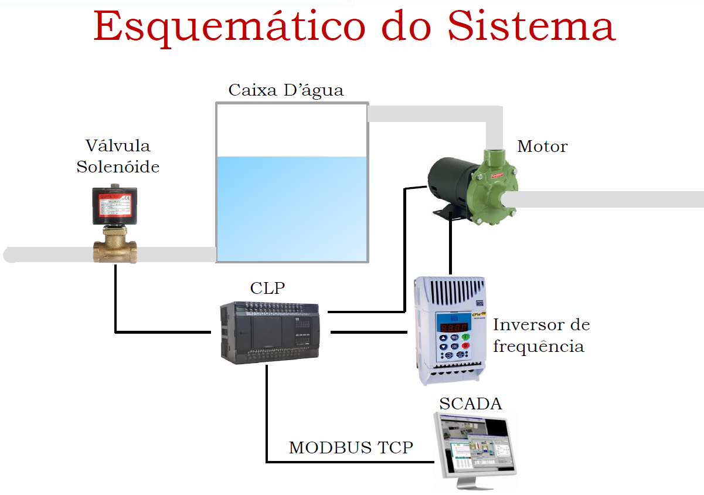


Requisitos

- O software supervisório deverá possuir os seguintes itens:
1. Monitoramento em tempo real das grandezas do processo, inclusive com a capacidade de traçar gráficos;
1. Capacidade de atuação no sistema;
1. Interface gráfica que represente de forma fidedigna o processo;
1. Capacidade de armazenamento e recuperação de dados históricos.
- Todas as variáveis disponíveis no CLP virtual deverão ser monitoradas.

Esquemático do Sistema

Esquema

Tabela de tags

|**Tag**|**Tipo**|**Endereço**|**Multiplicador**|
| - | - | - | - |
|estado\_mot|Escrita/Leitura (bits)|800|N/A|
|freq\_des|Escrita (words)|799|1|
|t\_part|Escrita/Leitura (words)|798|10|
|auto\_control|Escrita/Leitura (bits)|1000|N/A|
|freq\_mot|Leitura (words)|800|10|
|tensao|Leitura (words)|801|1|
|rotacao|Leitura (words)|803|1|
|pot\_entrada|Leitura (words)|804|10|
|corrente|Leitura (words)|805|100|
|temp\_estator|Leitura (words)|806|10|
|vz\_entrada|Leitura (words)|807|100|
|nivel|Leitura (words)|808|10|
|nivel\_h|Leitura (bits)|809|N/A|
|nivel\_l|Leitura (bits)|810|N/A|
|solenoide|Escrita/Leitura (bits)|801|N/A|

|**Tag**|**Tipo**|**Endereço**|**Multiplicador**|
| - | - | - | - |
|...|
|freq\_mot|Leitura (words)|800||10||
|tensao|Leitura (words)|801||1||
|rotacao|Leitura (words)|803||1||
|pot\_entrada|Leitura (words)|804||10||
|corrente|Leitura (words)|805||100||
|temp\_estator|Leitura (words)|806||10||
|vz\_entrada|Leitura (words)|807||100||
|nivel|Leitura (words)|808||10||
|...|
- **Multiplicador**: valor que deve ser utilizado para corrigir o valor da leitura/escrita;
- Na **leitura deve-se dividir** o valor lido pelo multiplicador;
- Na **escrita deve-se multiplicar** o valor a ser escrito pelo multiplicador antes de realizar o envio para o CLP.

|**Tag**|**Descrição**|
| - | - |
|estado\_mot|Estado do motor: 1 – ligado, 0 – desligado|
|freq\_des|Frequência de operação desejada para o motor (prop. à rotação)|
|t\_part|Tempo de partida do motor|
|auto\_control|
Escreva 1 para habilitar a partida automática do motor quando 

o nível estiver menor que o mínimo
|
|freq\_mot|Frequência do motor medida|
|tensao|Tensão da rede|
|rotacao|Rotação do motor|
|pot\_entrada|Potência ativa de entrada do inversor |
|corrente|Corrente de entrada do inversor (RMS)|
|temp\_estator|Temperatura do estator do motor|
|vz\_entrada|Vazão de entrada do tanque|
|nivel|Nível do tanque em litros (Volume máximo = 1000 L)|
|nivel\_h|Sensor de nível alto (Ativo se volume > 950 L)|
|nivel\_l|Sensor de nível baixo (Ativo se volume >100 L)|
|solenoide|Estado da solenóide: 1 – aberta, 0 - fechada|

Sugestão – Estrutura do software

- **Thread 1**
    - Interface gráfica
    - Representação da planta;
    - Capacidade de ligar e desligar o motor;
    - Capacidade de alterar a frequência do motor;
    - Capacidade de acionar a solenóide;
    - Gráficos em tempo real;
    - Menu de configurações;
    - Acesso a dados históricos;

- **Thread 2**
    - Loop
    - Leitura dos dados;!
    - Atualização da IG ();
    - Armazenamento de dados históricos ();
    - **Sleep**(scantime)

